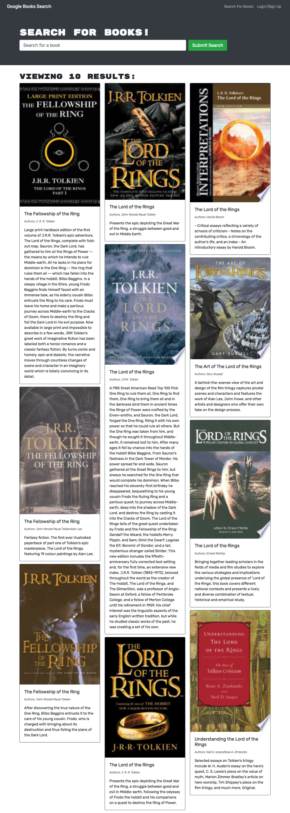

# Book Search Engine

### Powered By

           

## Description 

Search books with the google API all within a React app. Using Apollo Server, JSON web tokens, Mongoose, MongoDB, and GraphQL.

## Table of Contents
* [Usage](#Usage)
* [Credits](#Credits)
* [License](#License)
* [Questions](#Questions)

## Usage

## Credits

* Anders Ackerman
* [Xandromus](https://github.com/Xandromus)
* My Three Cats!

## License

Book Search Engine is licensed under the MIT license.

## Questions

If anybody has any questions please reach out to the creator of the project - Anders Ackerman via:
* Email: anders.swedishviking@gmail.com
* GitHub: (https://github.com/dj-viking)
